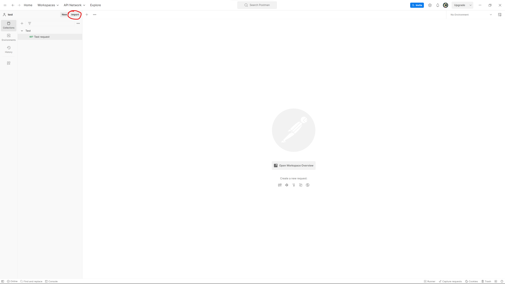
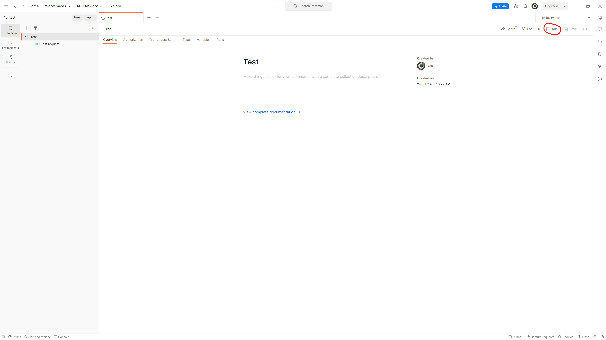
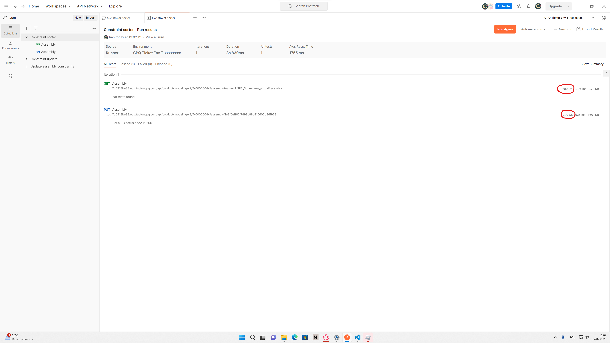

# To import collection, follow these steps:​

1. Download the collection you want to import.​

2. Open Postman and click on the "Import" button in the top-left corner of the app.​

3. Click on the "Files" button and navigate to the location where you saved the collection file.​

4. Select your file with enlargement .postman collection file and click "Open" to import it into Postman.​

5. Once the import is complete, you will see the imported collection in the Postman app.​

# To run collection, follow these steps:

1. Click on the Collection you want to run.​

2. Press "Run" button in top-right corner oh the app.​​

3. Run the Collection.​

# Correctness test:

After you run collection you should see somthing like this:

200 OK - Means that collection runned correctly.

404 Not Found - Means that something is wrong.

