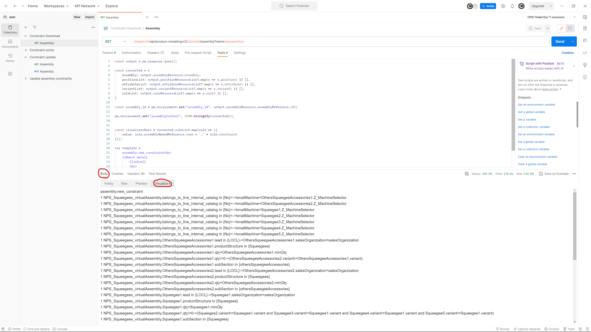

# 1. Import collection:​

  • Download the collection named "Constraint downloader.postman_collection" from github.​
  
  • Import it to postman (If oyu dont know how check [Collection instructions](https://github.com/SzymonFromPoland/cpq-postman/blob/main/Collection%20%20instructions.md)). 
  
  • Once the import is complete, you will see the imported collection in the Postman app.​

# 2. Run collection:

  • Go to Assembly in your collection and press "Send" in top-right corner of app.

  • In "Body" search tab "Vizsualize".

  

  • Copy everything you see there.

# 3. Creating .csv file:

  • Create new text file and paste what you copyed from Visualizer.

  • Save file as file with enlargement ".csv".

