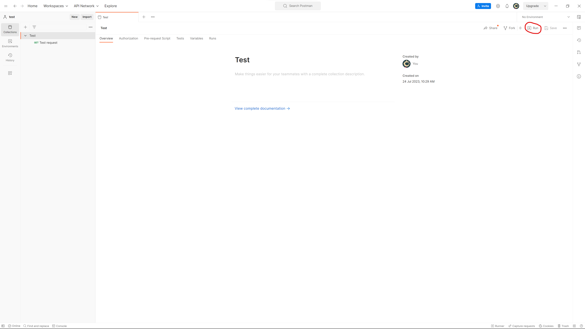
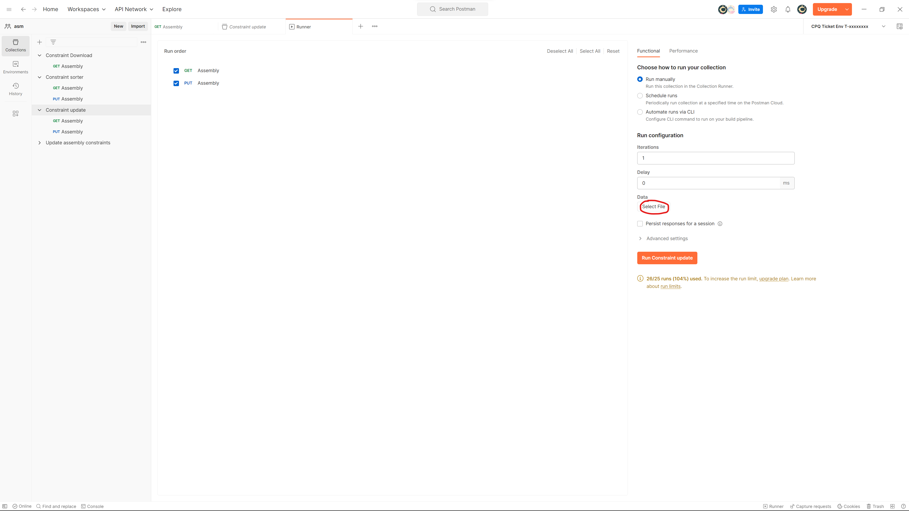

# 1. Import collection:​

  • Download the collection named "Constraint update.postman_collection" from github (folder "collections").​
  
  • Import it to postman (If oyu dont know how check [Collection instructions](https://github.com/SzymonFromPoland/cpq-postman/blob/main/Collection%20%20instructions.md)). 
  
  • Once the import is complete, you will see the imported collection in the Postman app.​

# 2. Run collection:

  • Click on the Collection you want to run.​

  • Press "Run" button in top-right corner oh the app.​​

  • Search "Select File" in "Data" section at right side of app.

  • Navigate .csv file with data you want to update.

  • Select it and press "Open".

  • On preview it should look like this:

  
  • Run the collection.

  # .csv file example:

  • [Example](https://github.com/SzymonFromPoland/cpq-postman/blob/main/examples/csv/example.csv).

  

