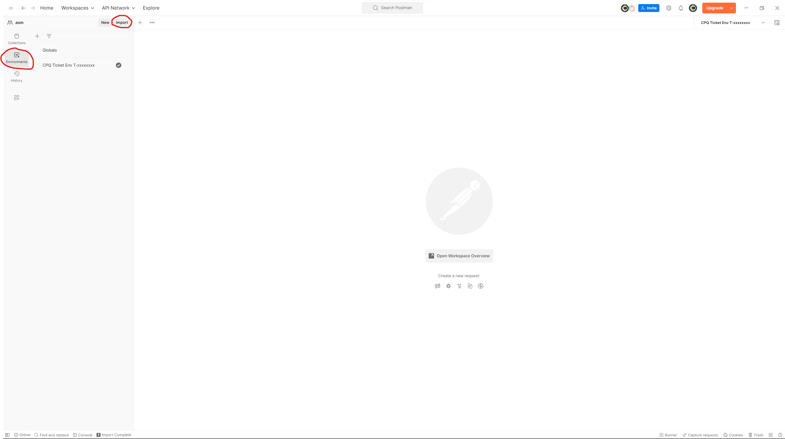
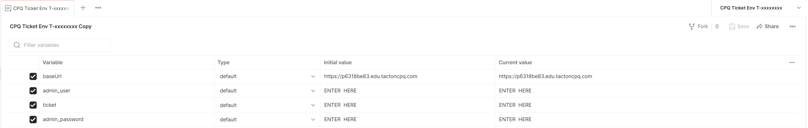
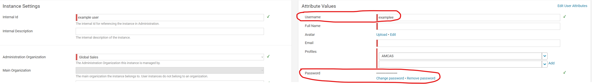

# Importing enviroment:

1. Download Enviroment ["CPQ ticket Env T-xxxxxxxx.postman.environment"](https://github.com/SzymonFromPoland/cpq-postman/blob/fc77baae68cf6374c0c15c44f3236c7f48a0200a/enviroment/CPQ%20Ticket%20Env%20T-xxxxxxxx.postman_environment.json) from github.

2. Go to postman and press "Environments" tab on left side of app.

3. Press import on top-right corner of app.

4. Press "file", navigate downloaded environment.

5. Select it and press "Open".

# Filling variables with data:

1. After you Import environment you will see this:

2. Fill variables with data:

   • admin_user - admin username,

   • ticket - ticket number (example: "T-00000029"),

   • admin_passwort - admin passwort,

