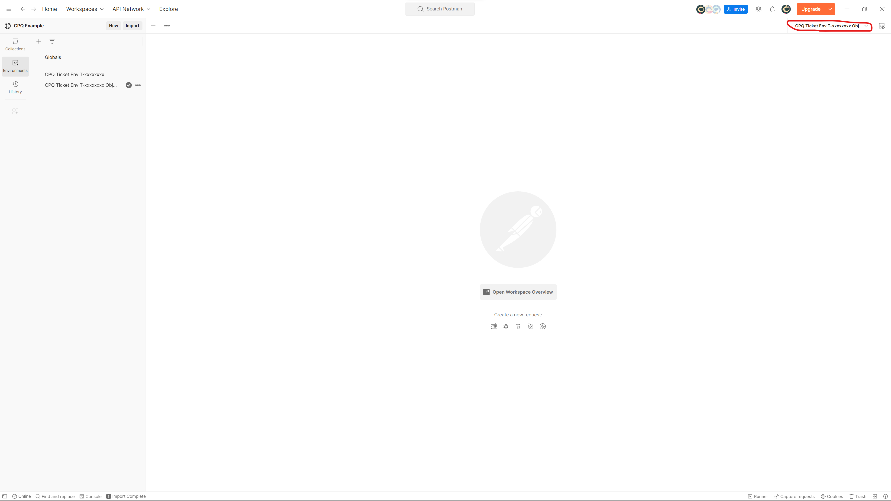
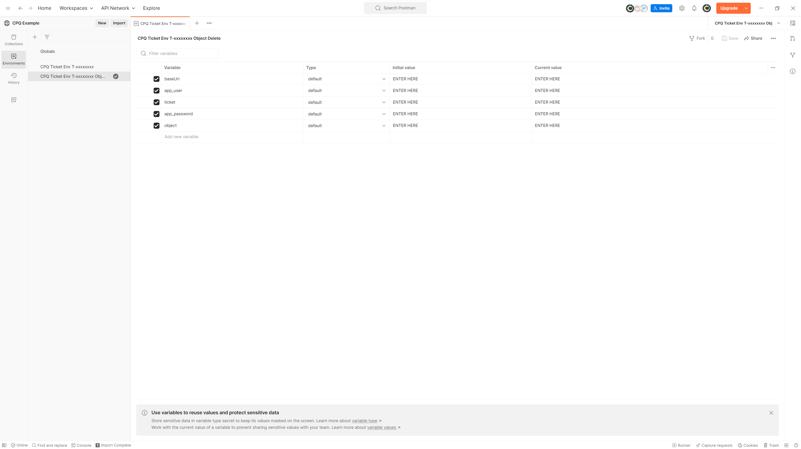
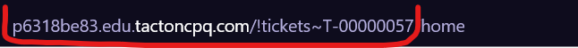

# Objective:

After running collection all objects from ticket will be deleted.

# Import environment:

  - Download environment named ["CPQ Ticket Env T-xxxxxxxx Object Delete.postman_environment"](enviroment/CPQ%20Ticket%20Env%20T-xxxxxxxx%20Object%20Delete.postman_environment.json) from "environment" folder.
  - Import it to Postman.
  - IMPORTANT: DON'T FORGET TO SELECT CORRECT ENVIRONMENT ("CPQ Ticket Env T-xxxxxxxx Object Delete" in this case) ON TOP RIGHT CORNER OF APP.

  

# Import collection:​

  - Download the collection named ["Object delete.postman_collection"](collections/Object%20delete.postman_collection.json) from github (folder "collections").​
  
  - Import it to postman (If oyu dont know how check [Collection instructions](https://github.com/SzymonFromPoland/cpq-postman/blob/main/Collection%20%20instructions.md)). 
  
  - Once the import is complete, you will see the imported collection in the Postman app.​

# Filling environment variables:

  - baseUrl - After you start test environment copy this part of url (T-00000057 is my example. if your ticket have other number then it will be diffrent):

  - app_user - path: "Ticket Details » Objects and Attributes » User » Instances » USER YOU CHOOSE)",
  - ticket - ticket (ex. "T-00000057"),
  - app_password - password you set while creating "app_user",
  - object - objects you want to delete (ex. "solution" will delete all solutions, "account" will delete all accounts)

# Run collection:

  - Check [Collection instructions](Collection%20%20instructions.md).
